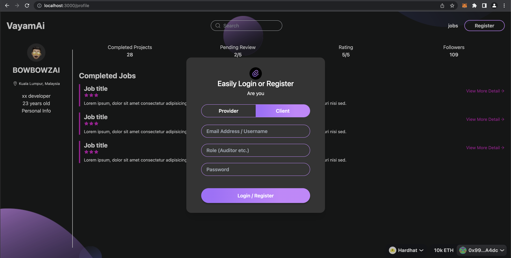
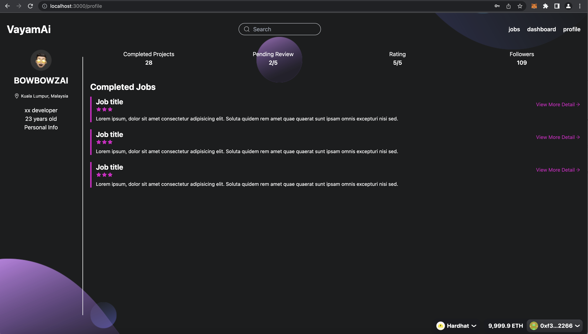
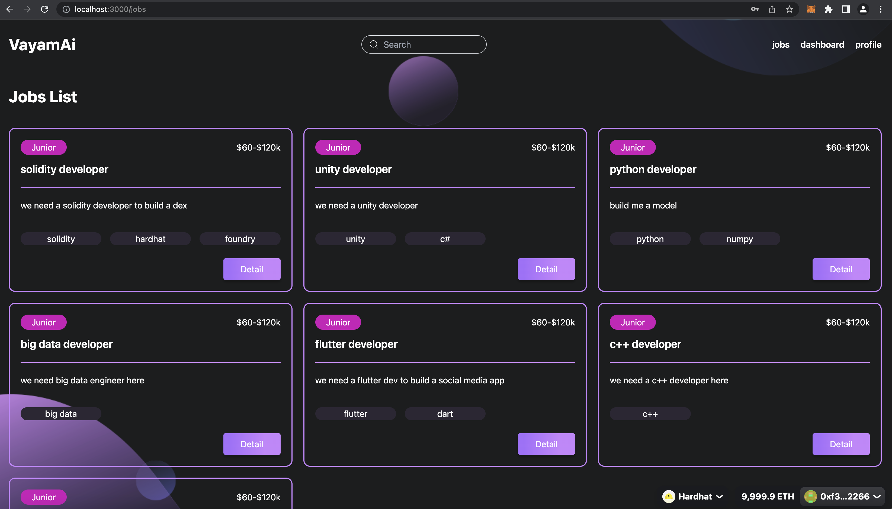
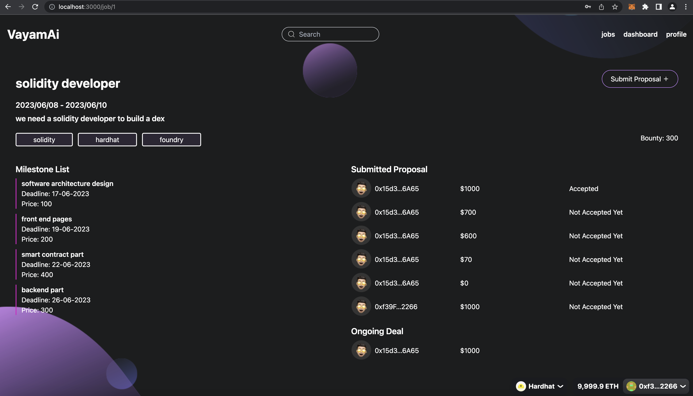
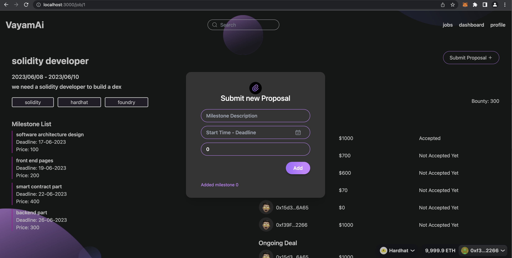
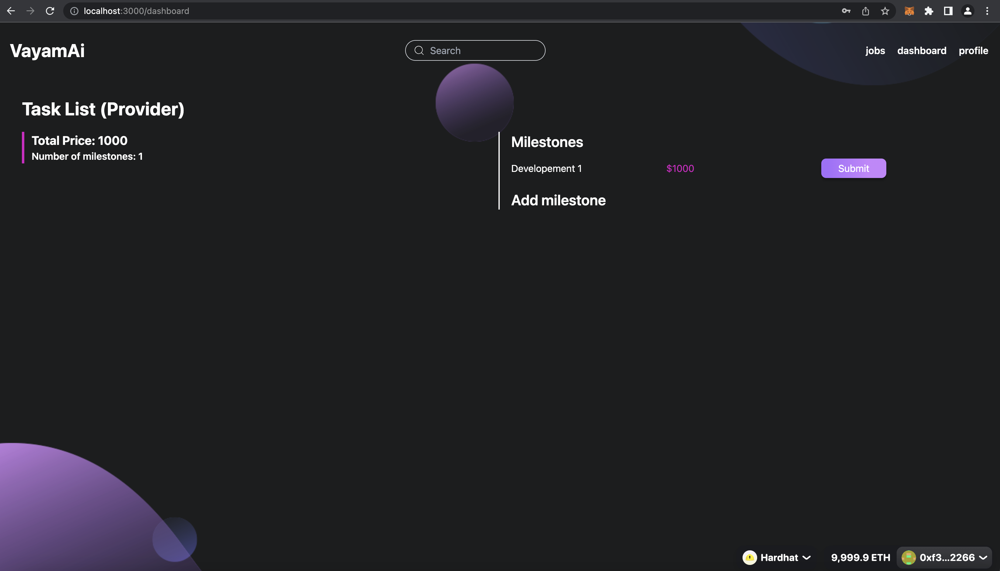

# VayamAI - Freelancing x Web3 x Ai Community

## Quick Start

```
run backend https://github.com/Top-Summer-Hackers/Vayam-AI-backend-rs

clone the repo https://github.com/Top-Summer-Hackers/VayamAI-monorepo.git
cd into it
run yarn install
run yarn chain
run yarn deploy
run yarn start

Available routes:
/ => landing page
/jobs => list of jobs
/dahsboard => client/provider dashboard (depends on the role selected when register)
/profile => user profile
/search/[keyword] => display a list of search results
/job/[id] => task/job detail
```

## Figma designs

https://www.figma.com/file/5JNdvO4xqMW83rUdT7SQkR/vayam-ai?type=design&node-id=3%3A2&t=cFDzZEfAlHLzxXJw-1

### documentation

https://www.notion.so/konradgnat/Revolutionizing-Freelancing-The-Future-of-Decentralized-Employment-f15075fc9c67477983eaf42cbfe27c40?pvs=4

# Summary

The biggest use case of Blockchain is simply money. The biggest power of Ethereum is to program money. Therefore the next logical application of Ethereum will be payments for human labor. The biggest rising trends for workers is to freelance, be location independent and to use Ai tools. Now combine all of these trends and first principles and you get VayamAi.

This is a hybrid Web2-Web3 app. Off-chain we are storing the job postings, user profiles and job proposals. On chain we have the job agreement, ratings and reviews, and milestone escrow using a battle tested protocol called ['Smart Invoice'](https://smartinvoice.xyz).

The protocol supports Ai centric culture by providing a place for established freelancers to post their best practices and be rewarded with crypto tips (not yet developed at hackathon MVP). It supports mentorship by promoting mentorship by those freelancers who receive the Mentor Soul-Bound NFT after completing 10 tasks with 5/5 stars ratings (on-chain part completed in MVP). A digital nomad lifestyle is promoted by a special articles section for experienced freelancers to share their best practices in sustainable location independent work life.

How does it work? First create a profile with your Ethereum wallet as a client (aka employer) or provider (aka freelancer). Next create a task posting with a description, list of skills required, start date and milestones. Freelancers will be able to submit proposals to the task. Next select a proposal that will become a new agreement. Submit the first milestone payment using smart invoice. After work is completed, and all payments are released, complete the task with a review and rating of the freelancer. If a freelancer completes 10 tasks with 5/5 star ratings, they are minted a Soul Bound NFT, that then grants them the privilege of being a mentor on the platform, posting in the mentors articles page and collecting tips and payments for their mentorship (full completion of this feature will be post hackathon MVP).

# Revolutionizing Freelancing: The Future of Decentralized Employment


> Crypto _Native X Ai X Nomad Freelancer Job Board_

## I. Crypto Native

The emergence of our crypto-native freelancer job board protocol signifies a paradigm shift in the employment landscape. This transformative platform, combining the powers of blockchain, DeFi, and advanced AI tools like ChatGPT, is poised to revolutionize the way we perceive and approach freelance work.


## II. Community First

Our protocol's innovative design disrupts the traditional freelancer platform model by eliminating fees. As a community-centric organization, we put people, not profits, at the heart of our platform. By eradicating fees, we create a more equitable environment where freelancers retain the full value of their labor, and employers receive high-quality services at a reduced cost. This, in itself, is a game-changer, propelling us towards a future where the economic benefits of work are more fairly distributed.

## III. Ai Centric

The integration of AI, particularly OpenAI's ChatGPT, is another cornerstone of our protocol. ChatGPT has the potential to revolutionize the way tasks are performed by offering high-quality automated services across a wide range of job categories. From writing and editing, to coding and design, AI can significantly augment the capabilities of freelancers, allowing them to deliver superior results faster and more efficiently. This AI-enhanced productivity that we mandate for all freelancers, when combined with our fee-free model, will attract a vast number of freelancers and employers to our platform, enabling us to onboard one million users within a year.

### IV. Mentorship

Our commitment to fostering a supportive and inclusive community sets us apart from conventional platforms. We believe that experienced freelancers have a wealth of knowledge that, when shared, can enhance the collective proficiency of our community. Therefore, we've incorporated a feature where seasoned freelancers mentor newcomers, promoting a culture of learning and growth. This nurturing environment will attract individuals seeking not just work, but also personal and professional development.


### V. Global Orientation

In this rapidly digitizing world, freelance work is becoming an increasingly important component of the global economy. As businesses and individuals alike seek more flexible, decentralized, and equitable work arrangements, our protocol is perfectly positioned to meet these evolving needs. By leveraging blockchain's transparency and security, AI's efficiency, and a strong community ethos, we are creating an employment ecosystem that is resilient, adaptable, and sustainable.

In conclusion, our crypto-native freelancer job board protocol is more than just a platform; it's a movement. We are shaping a future where work is decentralized, where individuals have access to global opportunities, and where community and collaboration drive growth and innovation. By rewriting the rules of freelance work, we are paving the way for a more equitable, efficient, and inclusive employment landscape that will endure for decades to come. This is not just a vision, but a tangible future we're creating, one block(chain) at a time.

## monetization plan

Freemium model
Free to use or all, monthly subscription packages with stripe integration for premium tier. Premium features include promotion of job postings and service provider profiles, plus more enhanced features to come.

## Screenshots

## Register User



## Profile Page



## Jobs List Page



## Job Detail Page



## Submit Proposal



## Dashboard Page


